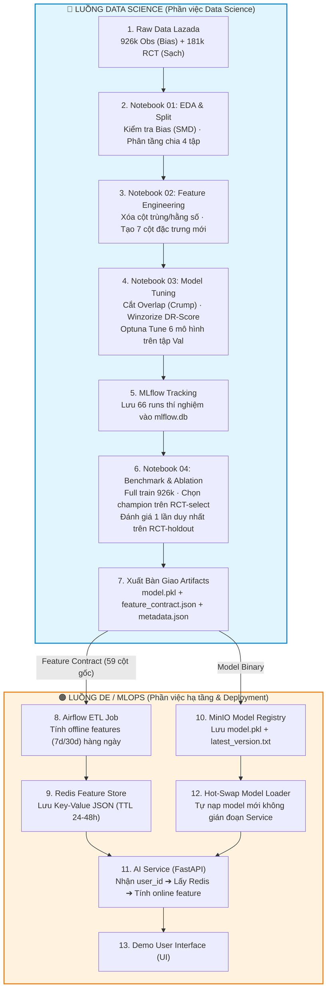

# Hướng Dẫn & Giải Thích Chi Tiết Dự Án Lazada Uplift Modeling (`final-lazada`)

Tài liệu này tổng hợp toàn bộ kiến thức, lý thuyết toán học, sơ đồ luồng dữ liệu và thiết kế hệ thống của dự án **Lazada Uplift Modeling (CATE Estimation Benchmark & Pipeline)** theo cách trực quan và dễ hiểu nhất.

---

## 💡 PHẦN 1: Bài Toán Thực Tế (Tại sao lại bắt đầu dự án này?)

### 1. Bài toán phát Voucher tại Lazada
Giả sử bạn có **100.000 voucher giảm giá 50k**. Nếu phát bừa bãi, Lazada sẽ bốc hơi vài tỷ đồng. Nếu là người quản lý, bạn sẽ tặng voucher cho ai?

Trong kinh doanh, khách hàng được chia thành **4 nhóm (4 Quadrants)**:

```text
 ┌──────────────────────────────────┬──────────────────────────────────┐
 │ 1. Sure Things (Chắc chắn mua)   │ 2. Lost Causes (Không mua nổi)   │
 │ • Không tặng voucher ➔ Vẫn mua   │ • Tặng voucher ➔ Vẫn KHÔNG mua   │
 │ 💥 Tặng voucher = TỐN TIỀN THỪA! │ 💥 Tặng voucher = PHÍ VOUCHER!    │
 ├──────────────────────────────────┼──────────────────────────────────┤
 │ 3. Sleeping Dogs (Chó ngủ)       │ 4. Persuadables (ĐỐI TƯỢNG VÀNG) │
 │ • Không tặng ➔ Mua bình thường   │ • KHÔNG tặng ➔ KHÔNG MUA         │
 │ • Tặng voucher ➔ Bực bội, bỏ mua │ • TẶNG VOUCHER ➔ MUA NGAY!       │
 │ 💥 Tuyệt đối ĐỪNG ĐỘNG VÀO!      │ 🎯 ĐÂY LÀ NHÓM DUY NHẤT CẦN TẶNG! │
 └──────────────────────────────────┴──────────────────────────────────┘
```

### 2. Sự khác biệt cốt lõi: Classification vs. Uplift Modeling (CATE)
* **Machine Learning Thông Thường (Classification):** Dự đoán $P(Y=1 \mid X)$ — *"Khách hàng này có mua không?"*. Mô hình sẽ tập trung nhắm vào nhóm **Sure Things** (Khách VIP vốn dĩ đã sẵn sàng mua).
* **Uplift Modeling / CATE:** Dự đoán hiệu ứng đối chứng điều kiện:
  $$\tau(X) = P(Y=1 \mid T=1, X) - P(Y=1 \mid T=0, X)$$
  — *"Tỷ lệ mua hàng TĂNG THÊM BAO NHIÊU nếu ta TẶNG VOUCHER ($T=1$) so với KHÔNG TẶNG ($T=0$)?"*.
  Mô hình nhắm chính xác vào nhóm **Persuadables** (Người chỉ mua khi có kích cầu)!

---

## ⚖️ PHẦN 2: Thách Thức Dữ Liệu & Lý Do Dùng Doubly Robust (DR)

Trên thực tế, dữ liệu lịch sử của Lazada là **Observational Data (Dữ liệu quan sát)** (~926k dòng):
* Hệ thống cũ có xu hướng **ưu tiên phát voucher cho khách VIP** (Tương tác nhiều, mua nhiều).
* Dẫn đến **Selection Bias (Thiên vị chọn lọc)**: Nhóm được tặng ($T=1$) và Không tặng ($T=0$) vốn dĩ đã KHÁC NHAU từ đầu. Nếu so sánh trực tiếp, ta sẽ bị lầm tưởng voucher có tác dụng khủng khiếp.

Để giải quyết bias này, dự án áp dụng các kỹ thuật **Causal Inference hiện đại**:
1. **Propensity Model ($e(X)$):** Dự đoán xác suất một người *được hệ thống tặng voucher*.
2. **Outcome Model ($\mu(X)$):** Dự đoán doanh số / hành vi mua hàng.
3. **Doubly Robust (DR) Estimator:** Kết hợp cả 2 mô hình trên để tạo ra **nhãn giả (Pseudo-outcome $\tilde{Y}$)**.
   * 🛡️ **Tính chất "Bảo vệ 2 lớp" (Doubly Robust):** Chỉ cần **1 trong 2** mô hình (Propensity HOẶC Outcome) đoán đúng, thì kết quả ước lượng Uplift $\tau(X)$ **vẫn chính xác tuyệt đối, không bị lệch (Unbiased)!**

---

## 🗺️ PHẦN 3: Sơ Đồ Luồng Tổng Quan Toàn Dự Án (Visual Pipeline)

Dưới đây là bức tranh toàn cảnh từ dữ liệu thô đến khi triển khai hệ thống (Data Science + Data Engineering):



---

## 📓 PHẦN 4: Chi Tiết Luồng 4 Notebooks Data Science

Dự án Data Science chạy qua **4 Notebooks độc lập** nối tiếp nhau qua các file trung gian (Parquet / JSON):

```text
[Raw CSV] ➔ 01_eda ➔ [split_assignment.parquet] 
                  ➔ 02_feature_engineering ➔ [train/val/rct_select/rct_holdout.parquet] 
                  ➔ 03_model_tuning ➔ [best_params.json + mlflow.db] 
                  ➔ 04_benchmark_evaluation ➔ [model.pkl + feature_contract.json]
```

### 🔹 Notebook 01: `01_eda.ipynb` (Phân tích Bias & Chia dữ liệu)
* **Nhiệm vụ:**
  1. Kiểm tra dữ liệu thô, loại bỏ cột hằng số và cột trùng lặp.
  2. Đo mức độ **Selection Bias** giữa nhóm $T=1$ và $T=0$ bằng chỉ số `SMD` (Standardized Mean Difference).
  3. **Chia dữ liệu làm 4 tập nghiêm ngặt:**
     * **`Train` (80% Obs ~ 741k):** Dùng để huấn luyện mô hình.
     * **`Val` (20% Obs ~ 185k):** Dùng để Optuna tinh chỉnh siêu tham số.
     * **`RCT-select` (50% RCT ~ 91k):** Dùng để các mô hình sau khi tune "đấu" chọn Quán quân.
     * **`RCT-holdout` (50% RCT ~ 91k):** **TẬP BẤT KHẢ XÂM PHẠM.** Chỉ mở ra đúng 1 lần ở bước cuối để báo cáo.

### 🔹 Notebook 02: `02_feature_engineering.ipynb` (Làm sạch & Kỹ nghệ đặc trưng)
* **Nhiệm vụ:**
  1. Xóa các cột thừa từ Notebook 01.
  2. Tạo **7 đặc trưng dẫn xuất mới** (Ví dụ: tỷ lệ tương tác 7 ngày/30 ngày, tổng số dư ví, mức độ hoạt động...).
  3. Tổng số đặc trưng là **76 cột**. Xuất ra 4 file Parquet sạch.

### 🔹 Notebook 03: `03_model_tuning.ipynb` (Tinh chỉnh siêu tham số)
* **Nhiệm vụ:**
  1. **Xử lý Overlap:** Dùng quy tắc Crump et al. để loại bỏ các dòng dữ liệu có Propensity score cực đoan ($e < \alpha$ hoặc $e > 1-\alpha$) gây nhiễu.
  2. Tạo nhãn giả **Doubly Robust score ($\tilde{Y}$)** trên tập `Val`.
  3. Dùng **Optuna** chạy 66 runs thử nghiệm để tìm bộ tham số tốt nhất cho 6 họ mô hình (`DRLearner`, `LinearDML`, `NonParamDML`, `CausalForestDML`, `S-Learner`, `T-Learner`).
  4. Đánh giá bằng thước đo **DR-AUUC** (Diện tích dưới đường cong Uplift Doubly Robust).
  5. Lưu vết toàn bộ thí nghiệm vào **`mlflow.db`**.

### 🔹 Notebook 04: `04_benchmark_evaluation.ipynb` (Đánh giá cuối & Đóng gói)
* **Nhiệm vụ:**
  1. Nạp bộ tham số tối ưu từ Notebook 03, **Full Train** trên 926k dòng (`Train` + `Val`).
  2. Cho 6 mô hình đấu nhau trên tập **`RCT-select`**. Kết quả: **`DRLearner` dành chiến thắng**.
  3. **Ablation Study:** Rút gọn đặc trưng từ 76 cột xuống **62 cột an toàn (chứa 59 cột gốc)** cho production.
  4. Mở tập **`RCT-holdout`** đánh giá 1 lần duy nhất: Qini Score = `0.0232`, ATE = `0.00376` (tăng `0.376%` tỷ lệ mua).
  5. Đóng gói artifacts bàn giao: `model.pkl`, `feature_contract.json`, `metadata.json`.

---

## 🚀 PHẦN 5: Luồng Chạy Real-Time Trên Production (DE / MLOps)

Khi ứng dụng Lazada chạy trên máy khách hàng, luồng xử lý diễn ra như sau:

```text
Khách hàng mở App 
    │
    ▼
FastAPI nhận `user_id` 
    │
    ├── 1. Tra cứu Redis ➔ Lấy 55 đặc trưng offline (lịch sử mua hàng 7d/30d do Airflow tính)
    ├── 2. Tự tính tại chỗ ➔ 4 đặc trưng online (khung giờ hiện tại, thiết bị...)
    └── 3. Ghép thành 7 cột dẫn xuất ➔ Đủ 76 đặc trưng theo `feature_contract.json`
    │
    ▼
Đưa 76 đặc trưng vào `model.pkl` (đã nạp từ MinIO)
    │
    ▼
Mô hình trả về điểm Uplift τ(X)
    │
    ├── Nếu τ(X) > Ngưỡng ➔ 🎟️ HIỆN VOUCHER (Nhóm Persuadables)
    └── Nếu τ(X) ≤ Ngưỡng ➔ ❌ KHÔNG HIỆN VOUCHER (Nhóm Sure Things / Lost Causes)
```

---

## 📐 PHẦN 6: Chi Tiết Toán Học Cơ Chế Doubly Robust (Bảo vệ 2 lớp)

### 1. Công thức Nhãn Giả Doubly Robust ($\tilde{Y}$)

$$\tilde{Y} = \underbrace{\mu_1(X) - \mu_0(X)}_{\text{Dự đoán ban đầu từ Outcome Model}} \;+\; \underbrace{\frac{T \cdot (Y - \mu_1(X))}{e(X)}}_{\text{Phần hiệu chỉnh cho nhóm T=1}} \;-\; \underbrace{\frac{(1-T) \cdot (Y - \mu_0(X))}{1 - e(X)}}_{\text{Phần hiệu chỉnh cho nhóm T=0}}$$

* Trong đó:
  * $\mu_1(X) = P(Y=1 \mid T=1, X)$: Khả năng mua khi được tặng voucher.
  * $\mu_0(X) = P(Y=1 \mid T=0, X)$: Khả năng mua khi không được tặng voucher.
  * $e(X) = P(T=1 \mid X)$: Xác suất được tặng voucher (Propensity Score).

---

### 2. Chứng minh Toán học 2 Trường Hợp "Bảo Vệ 2 Lớp"

#### 🔴 TRƯỜNG HỢP 1: Outcome Model ($\mu$) ĐÚNG, Propensity Model ($e$) SAI ($e_{sai}$)

* Vì Outcome Model $\mu(X)$ **ĐÚNG**, giá trị dự đoán $\mu_1(X)$ chính bằng giá trị thực tế trung bình $E[Y \mid T=1, X]$.
* Do đó, **sai số trung bình bằng 0**:
  $$E[Y - \mu_1(X) \mid T=1, X] = 0 \quad \text{và} \quad E[Y - \mu_0(X) \mid T=0, X] = 0$$

Lấy kỳ vọng của $\tilde{Y}$:

$$E[\tilde{Y} \mid X] = \mu_1(X) - \mu_0(X) + \frac{\overbrace{E[T(Y - \mu_1(X)) \mid X]}^{= 0}}{e_{sai}(X)} - \frac{\overbrace{E[(1-T)(Y - \mu_0(X)) \mid X]}^{= 0}}{1 - e_{sai}(X)}$$

$$E[\tilde{Y} \mid X] = \mu_1(X) - \mu_0(X) + 0 - 0 = \tau(X)$$

💥 **Kết luận TH1:** Tử số bằng $0$ làm cả cụm hiệu chỉnh triệt tiêu về $0$. Dù $e_{sai}(X)$ đoán sai cỡ nào, kết quả vẫn ra đúng CATE $\tau(X)$!

---

#### 🔵 TRƯỜNG HỢP 2: Propensity Model ($e$) ĐÚNG, Outcome Model ($\mu$) SAI ($\mu_{sai}$)

* Vì Propensity Model $e(X)$ **ĐÚNG**, ta có $E[T \mid X] = e(X)$ và $E[1-T \mid X] = 1 - e(X)$.
* Kỳ vọng của cụm hiệu chỉnh thứ hai (nhóm $T=1$):

$$E\left[ \frac{T \cdot (Y - \mu_1^{sai}(X))}{e(X)} \;\middle|\; X \right] = \frac{E[T \mid X] \cdot E[Y^{(1)} - \mu_1^{sai}(X) \mid X]}{e(X)} = \frac{e(X) \cdot \left( E[Y^{(1)} \mid X] - \mu_1^{sai}(X) \right)}{e(X)} = E[Y^{(1)} \mid X] - \mu_1^{sai}(X)$$

Thế tất cả vào công thức $\tilde{Y}$:

$$E[\tilde{Y} \mid X] = \left( \mu_1^{sai}(X) - \mu_0^{sai}(X) \right) + \left( E[Y^{(1)} \mid X] - \mu_1^{sai}(X) \right) - \left( E[Y^{(0)} \mid X] - \mu_0^{sai}(X) \right)$$

Triệt tiêu đại số:
$$E[\tilde{Y} \mid X] = \cancel{\mu_1^{sai}(X)} - \cancel{\mu_0^{sai}(X)} + E[Y^{(1)} \mid X] - \cancel{\mu_1^{sai}(X)} - E[Y^{(0)} \mid X] + \cancel{\mu_0^{sai}(X)}$$

$$E[\tilde{Y} \mid X] = E[Y^{(1)} \mid X] - E[Y^{(0)} \mid X] = \tau(X)$$

💥 **Kết luận TH2:** Các đại lượng đoán sai $\mu^{sai}(X)$ đã **TỰ TRIỆT TIÊU LẪN NHAU**. Cụm $e(X)$ chính xác đã gánh toàn bộ sai số và đưa về đúng CATE $\tau(X)$!

---

### 📊 Bảng Tóm Tắt Tình Huống

| Trạng thái Outcome Model ($\mu$) | Trạng thái Propensity Model ($e$) | Kết quả ước lượng CATE ($\tilde{Y}$) | Giải thích ngắn gọn |
| :--- | :--- | :--- | :--- |
| **ĐÚNG** ✅ | **SAI** ❌ | **CHÍNH XÁC** 🎯 | Tử số của phần hiệu chỉnh bằng 0 ➔ Triệt tiêu |
| **SAI** ❌ | **ĐÚNG** ✅ | **CHÍNH XÁC** 🎯 | Trọng số $e(X)$ triệt tiêu hoàn toàn phần đoán sai của $\mu$ |
| **ĐÚNG** ✅ | **ĐÚNG** ✅ | **SIÊU CHÍNH XÁC** 🚀 | Tốc độ hội tụ sai số siêu nhanh $O(n^{-1/2})$ (Neyman Orthogonality) |
| **SAI** ❌ | **SAI** ❌ | **BỊ LỆCH (Bias)** ⚠️ | Cả 2 lớp bảo vệ đều thủng (Cần dùng LightGBM/XGBoost mạnh để giảm rủi ro) |

---

### 💡 Ví dụ Đời Thực Dễ Tưởng Tượng

Hãy tưởng tượng bạn đang **đo chiều cao của một tòa nhà**:
* **Outcome Model ($\mu$):** Giống như bạn đứng xa dùng mắt **đoán mò** chiều cao tòa nhà.
* **Propensity Model ($e$):** Giống như cái **thước dây** điều chỉnh sai số.

* Nếu mắt bạn nhìn **chuẩn 100%** (Outcome đúng) $\rightarrow$ Không cần thước dây, kết quả ra đúng luôn!
* Nếu mắt bạn nhìn **sai bét** (đoán thấp hơn 5m) $\rightarrow$ Thước dây (Propensity score đúng) sẽ đo ra khoảng lệch đúng +5m và cộng bù vào cho bạn. Kết quả cuối cùng vẫn đúng 100%!
* Bạn chỉ đoán sai chiều cao tòa nhà khi **CẢ MẮT BẠN NHÌN SAI VÀ THƯỚC DÂY CỦA BẠN CŨNG BỊ GIÃN/SAI!**
