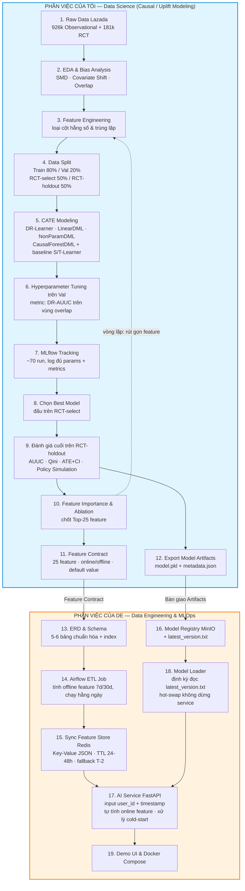

A. Chủ đề của tôi cần thực hiện
"Nghiên cứu thực nghiệm về các phương pháp ước lượng Doubly Robust CATE cho bài toán uplift modeling — so sánh DR-Learner và Double Machine Learning cho định hướng nâng cấp pipeline cá nhân hóa khuyến mãi" 

Executive summary 

Tiến hành nghiên cứu thực nghiệm chuyên sâu so sánh các phương pháp ước lượng Conditional Average Treatment Effect (CATE) với đặc tính doubly robust, tập trung vào 2 family chính: 

1. DR-Learner family (Kennedy 2020): 

Construct pseudo-outcome bằng công thức doubly robust (kết hợp outcome model + propensity model). 

Regress pseudo-outcome trên feature space để estimate CATE τ^(x)\hat{\tau}(x) τ^(x). 

2. DML family (Chernozhukov et al. 2018) — candidate upgrade cho pipeline: 

LinearDML: partial-out residualization + linear final stage → interpretable coefficients. 

NonParamDML: partial-out residualization + flexible ML final stage → complex CATE surface. 

CausalForestDML: DML với causal forest final stage → valid confidence interval từ honest splitting. 

Deliverable là empirical study rigorous trên 01 public datasets, bao gồm reproducible codebase, benchmark table, ablation studies, và recommendation cụ thể. Intern sẽ hiểu được Neyman-orthogonality, cross-fitting mechanics, doubly robust property, valid confidence interval construction, và empirical trade-offs giữa các phương pháp CATE estimation hiện đại. 

Sơ đồ luồng phần việc — tôi (DS) và bạn cùng nhóm (DE)

Khối màu xanh (Phần việc của tôi — DS): Toàn bộ quy trình nghiên cứu từ EDA, kỹ nghệ đặc trưng, chia dữ liệu, huấn luyện và tinh chỉnh các mô hình CATE (DR-Learner & DML), ghi vết thí nghiệm trên MLflow, cho tới đánh giá cuối cùng trên tập RCT giấu kín. Điểm cốt lõi của thiết kế thực nghiệm: tập Val dùng để tinh chỉnh siêu tham số, tập RCT-select dùng để chọn quán quân giữa các mô hình, còn tập RCT-holdout chỉ chạy đúng một lần để lấy con số báo cáo — tránh việc chọn mô hình dựa trên chính tập test. Đầu ra bàn giao gồm Feature Contract (25 đặc trưng + phân loại online/offline + giá trị mặc định cho user mới) và Model Artifacts.

Khối màu cam (Phần việc của DE): Từ Feature Contract thiết kế ngược bảng phẳng thành 5-6 bảng chuẩn hóa có index, dựng job Airflow tính đặc trưng offline theo cửa sổ 7/30 ngày chạy hằng ngày, đồng bộ lên Redis dưới dạng Key-Value JSON kèm TTL và cơ chế fallback T-2 khi job lỗi. Phía phục vụ gồm MinIO (Model Registry kèm file latest_version.txt), FastAPI (AI Service tự tính đặc trưng online từ timestamp và xử lý user mới chưa có dữ liệu), Model Loader hot-swap mô hình, Demo UI và đóng gói Docker.

Đoạn Mermaid ở trên là nguồn duy nhất của sơ đồ quy trình; khi cần ảnh cho slide, render trực tiếp từ đoạn này.
